<p align="center">
  <strong>-------></strong> 
  <a href="/README_en_EN.md">English</a> | 
  <a href="/README.md">Русский</a> 
  <strong><-------</strong>
</p>

<p align="center">
  <picture>
    <source media="(prefers-color-scheme: dark)" srcset="./media/logo-dark.png">
    
  </picture>
</p>


<div align="center">

[](https://github.com/AnikBeris)
[](/LICENSE.md)
[](https://github.com/AnikBeris)

</div>

<div align="center">
  
</div>


<h1 align="center"> 
Краткие заметки для работы с `Widgets` в Unreal Engine 5 ( Tutorial ) 
</h1>

<h2 align="center">
> 💡 Материал ориентирован на разработчиков, которые уже знакомы с `Widgets` и `Blueprints`
</h2>


* * * * * * * * * * * * * * * * * * 
* * * * * * * * * * * * * * * * * * 


<h2 align="center">
⚠️ Отказ от ответственности
</h2>

<p align="center">
  Автор не несёт ответственности за любые возможные последствия использования данного проекта.<br>
  Используйте на свой страх и риск.
</p>

---

<h3 align="center"> 
💖 Поддержите проект 
</h3>

<p align="center"> 
Если этот проект оказался полезным для Вас, вы можете оценить его, поставив звёздочку.:star2: 
</p>

<p align="left">
  <a href="https://pay.cloudtips.ru/p/7249ba98" target="_blank">
    
  </a>
  <a href="https://pay.cloudtips.ru/p/7249ba98" target="_blank">
    
  </a>
</p>


<h4 align="center"> 
Пожертвования горячо приветствуются, какими бы маленькими они ни были, и большое спасибо. 😌 
</h1>

<div align="center">

|  |  |
|-------------:|:-------------|
| **Tether USDT (BEP20)** |`0x22258ea591966e830199d27dea7c542f31ed5dc5`|
| **Bitcoin (BTC)** |`1Dbwq9EP8YpF3SrLgag2EQwGASMSGLADbh`|
| **Ethereum (ERC20)** | `0x22258ea591966e830199d27dea7c542f31ed5dc5`|
| **Binance Smart Chain (BEP20)** | `0x22258ea591966e830199d27dea7c542f31ed5dc5`|
| **Solana (SOL)** | `yYYXsiVTzsvfvsMnBxfxSZEWTGytjAViE2ojf3hbLeF`|
| **Cloud tips** | [cloudtips](https://pay.cloudtips.ru/p/7249ba98) |

</div>

---

<p align="center">
  <sub> Спасибо за Ваше внимание к проекту и за поддержку 💙 </sub>
</p>

---

* * * * * * * * * * * * * * * * * * 
* * * * * * * * * * * * * * * * * * 


## 📚 Содержание

- [Введение](#-введение)
1. [Настройка статистики](#-1-настройка-статистики)
2. [Создание таблицы лидеров (Leaderboard)](#-2-создание-таблицы-лидеров-leaderboard)
3. [Настройка достижений (Achievements)](#-3-настройка-достижений-achievements)

- [Чертёж логики (Blueprint)](#-чертёж-логики-blueprint)
4. [Прописываем Steam в конфигах Unreal Engine 5](#-4-подключение-steamworks-steam-к-unreal-engine-5)
5. [Чтение статистики](#-5-чтение-статистики)
6. [Работа со статистикой](#-6-работа-со-статистикой)
7. [Сброс статистики и достижений](#-7-сброс-статистики)

8. [Кодовая часть (Blueprints в Unreal Engine 5)](#-8-кодовая-часть-в-unreal-engine-5-blueprints)


## 🔗 Полезные ссылки
- [Статистика и достижения](https://partner.steamgames.com/doc/features/achievements#1)
- [AVGRATE-статистика](https://partner.steamgames.com/doc/features/achievements#AVGRATE)
- [Сброс статистик](https://partner.steamgames.com/doc/features/achievements#9)
- [Общая статистика](https://partner.steamgames.com/doc/features/achievements#global_stats)
- [Достижения](https://partner.steamgames.com/doc/features/achievements/ach_guide)
- [Статистики](https://partner.steamgames.com/doc/features/achievements/stats_guide)

* * * * * * * * * * * * * * * * * * 
* * * * * * * * * * * * * * * * * * 


## 📊 Вводная информация

<h2 align="Left"> 
🎮 История о том, как я настраиваю достижения, статистику и таблицы лидеров в Steamworks
</h2>


<h2 align="center">
  <a href="#-содержание">⬆️ Наверх</a> 
</h2>


## 📊 1.

<div align="center">
  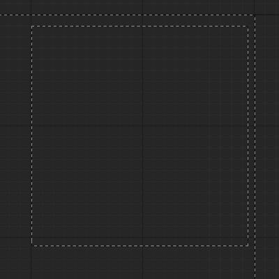
</div>

<details> 
    <summary>⚙️ Развернуть описание</summary>

- Создаём 2 `Widgets`

<div align="center">
  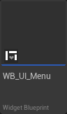
  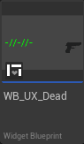
</div>

1. `WB_UI_Menu` - меню где будем тестить

```info
WB_UI_Menu
```

2. `WB_UX_Dead` - мастер виджет для вывода нашего текста

```info
WB_UX_Dead
```


- создаём 2 `Data Table` и 1 `Rich Text Block Image Decorator`

<div align="center">
  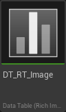
  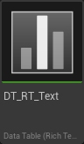
</div>

1. Выбираем `Data Table` и в поиске вводим `Rich`

```info
Rich
```

<div align="center">
  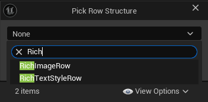
</div>

2. Выбираем вначале `Rich Text`

```info
DT_RT_Text
```

3. Потом выбираем создаём `Rich Text Image`

```info
DT_RT_Image_Weapon
```

4. после чего создаём блупринт `Rich Text Block Image Decorator`

<div align="center">
  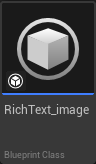
</div>

<div align="center">
  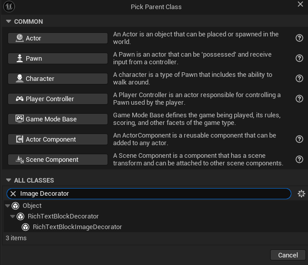
</div>

```info
RichText_imadge_Weapon
```

---

## Работа с `Data Table`

1. Открываем `DT_RT_Text` и расписываем конфиги

<div align="center">
  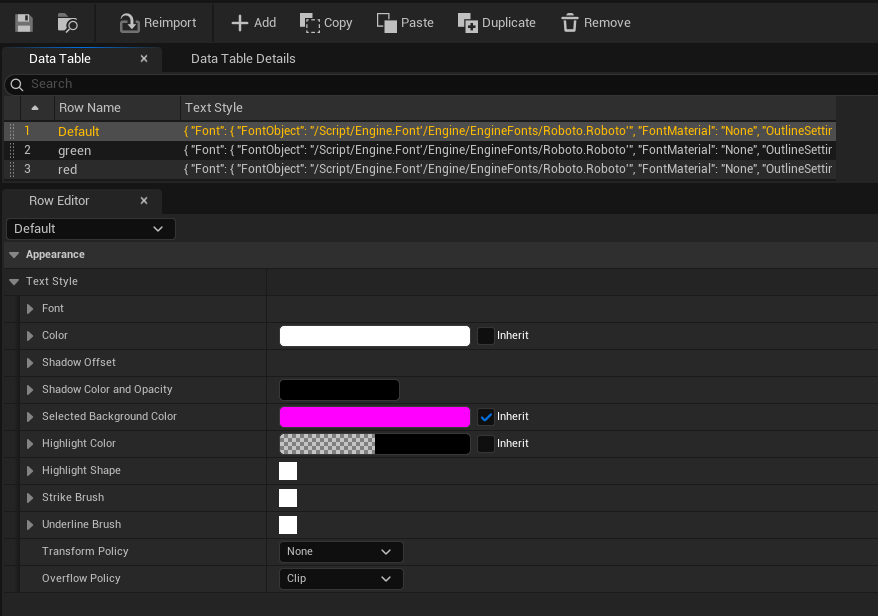
</div>

<details> 
    <summary>⚙️ Названия </summary>

```info
Default
```

```info
green
```

```info
red
```
</details> 

---

2. Открываем `DT_RT_Image` и расписываем конфиги

<div align="center">
  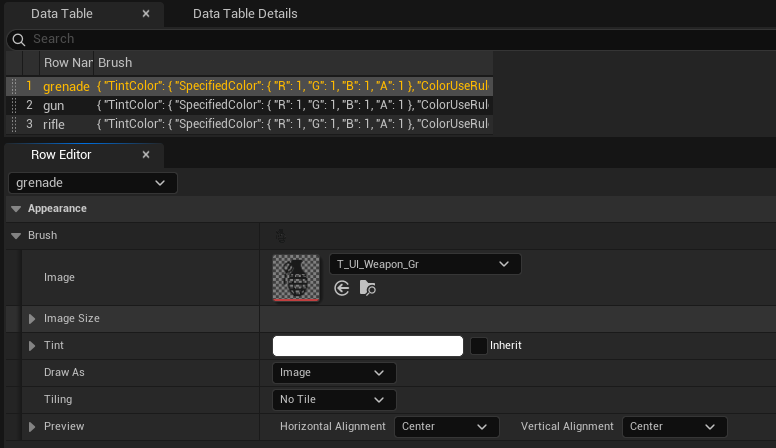
</div>

<details> 
    <summary>⚙️ Названия </summary>

```info
Default
```

```info
grenade
```

```info
gun
```

```info
rifle
```

</details> 

---

3. Открываем декоратор `RichText_image` и назначаем в нём `DT_RT_Image` для того что бы мы смогли его использовать из текста.

<div align="center">
  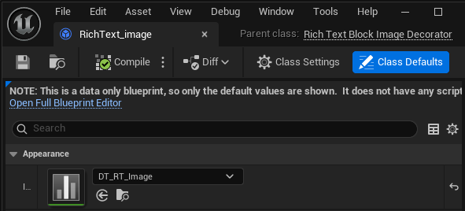
</div>


---


## Работа с `Widgets`

Открываем Widgets `WB_UX_Dead` и сохдаём эрархию из 

```
.
└── Size Box
    └── Border
        └── Scale Box
            └── RichText

```

<details> 
    <summary>⚙️ Названия </summary>

```info
Size Box
```

```info
Border
```

```info
Scale Box
```

```info
RichText
```

</details> 

- создаём переменные

<div align="center">
  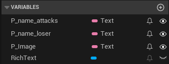
</div>

- Включаем параметры

<div align="center">
  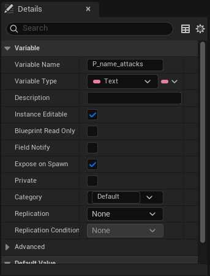
</div>

<details> 
    <summary>⚙️ Названия </summary>

```info
P_name_attacks
```

```info
P_name_loser
```

```info
P_Image
```

</details> 


- после чего расписываем логику

<div align="center">
  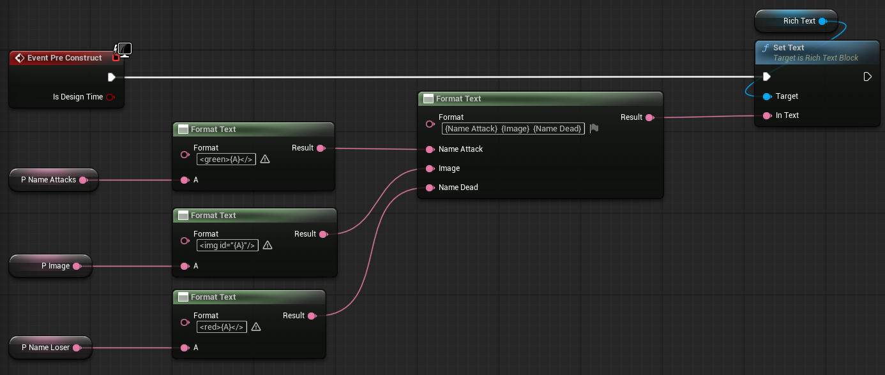
</div>


---


Открываем Widgets `WB_UI_Menu` и создаём эрархию из 


```
.
└── Canvas Panel
    └── VerticalBox

```

<details> 
    <summary>⚙️ Названия </summary>

```info
Canvas Panel
```

```info
VerticalBox
```

</details> 

- создаём переменные

<div align="center">
  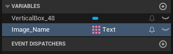
</div>

<details> 
    <summary>⚙️ Названия </summary>

```info
Image_Name
```

</details> 

- после чего расписываем логику

<div align="center">
  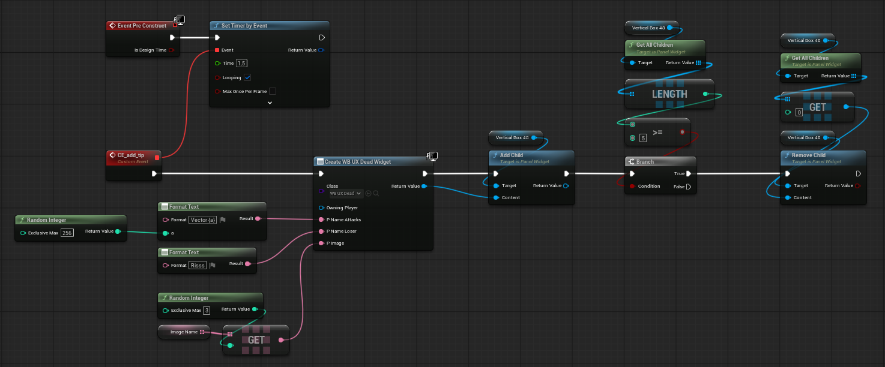
</div>


---


</details>

<div align="center">
  
</div>


<h2 align="center">
  <a href="#-содержание">⬆️ Наверх</a> 
</h2>


## 📊 2.

<div align="center">
  
</div>

<details> 
    <summary>⚙️ Развернуть описание</summary>

---

---

</details>

<div align="center">
  
</div>


<h1 align="center"> 📜 Лицензия </h1>
<p align="center">
  <strong> Этот проект распространяется по </strong> 
  <a href="/LICENSE">MIT License</a> 
</p>

---

<h2 align="center"> 
Документация ознакомьтесь с ней 
</h2>

<p align="center">
  <strong>-------></strong> 
  <a href="/README_en_EN.md"> English </a> | 
  <a href="/README.md"> Русский </a> 
  <strong><-------</strong>
</p>


